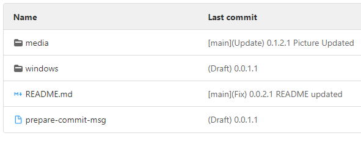

# Usefull hook for Git



## prepare-commit-msg
This hook is a Python script. Libraries used: **re**, **sys**, **subprocess**

What hook do:
- Detect current branch name and last commit message from remote
- Lookup version number in last commit message
- Lookups keywords triggers in new commit message (**rr** - release, **uu** - update, **ff** - fix, **dd** - draft)
- Generates incremented version number based on detected triggers (version based on template: **W.X.Y.Z** where **W** for release, **X** for update, **Y** for fix, **Z** for draft).
- If trigger detected, hook generates brand new commit message with template:  

```[Branch name][Type of commit by trigger] [New version number of commit] [User commit message]```

- If no trigger detected, hook adds (Draft) prefix and version numder in front of user's text

# How to use
- Copy file to **.git/hooks/** folder inside local cloned repo
- Don't forget to make it executable ```chmod +x prepare-commit-msg```
- Use triggers in your commit message:

**For release:** ```git commit -m "rr Some release notes"```  
**For update:** ```git commit -m "uu Some update notes"```  
**For fix:** ```git commit -m "ff Some fix notes"```  
**For draft:** ```git commit -m "dd Some fix notes"```

- **Tip**: you just can print trigger (exampe - ff) and commit - it will looks like: [Branch name] [Type of commit by trigger] [new version number of commit]

## Howto

To use hooks, place it to **.git/hooks** directory inside your local cloned repo. Hook will be accessible for current project only.  
To use hook globally place it to common folder and set up Git:

```bash
mkdir ~/.git_hooks
cp prepare-commit-msg ~/.git_hooks
git config --global core.hooksPath ~/.git_hooks
```
**Tip**: On MacOS you can get error "fatal: cannot run ~/.git_hooks/prepare-commit-msg: No such file or directory". First of all verify Python binary location:

```bash
which python3
```

and fix it in shebang of script file. If not - use Windows way: create bash script to run python script

## On Windows
On Windows systems some trick must be used, because Git couldn't run Python interpreter correctly: create Shell script to run Python script.  
In "windows" repo folder you can find prepared files.

Do next steps:

1. Copy files from "windows" repo folder somewhere you like
2. Make files executable (fore example using Linux-like syntax in GitBash):  
```bash
chmod +x prepare-commit-msg && chmod +x prepare-commit-msg.py
```  
3. Set up Git global hook folder where you've put hook files (for example c:\\users\\your_user_name\\.git_hooks\\):  
```bash
git config --global core.hooksPath c:\users\your_user_name\.git_hooks\
```

### Tip
On Windows you can receive an error: ***error: cannot spawn .git/hooks/prepare-commit-msg: No such file or directory***  
As for me it was fixed by using configuring Git global hook folder as shown above.